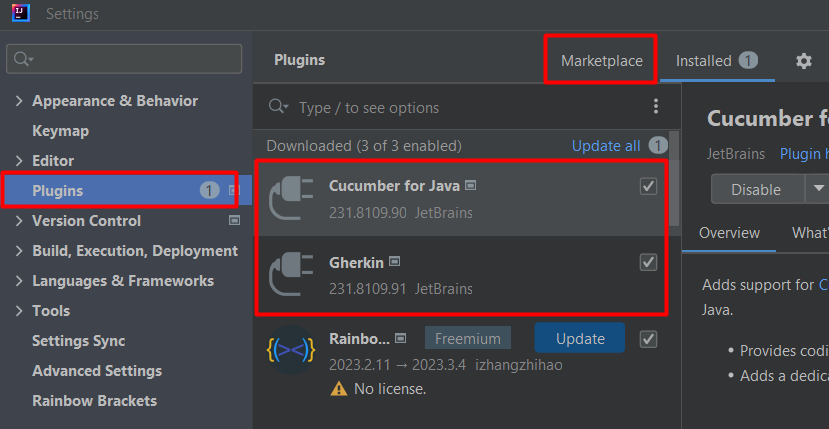

# UI Technical Test using Selenium, Cucumber, and Serenity BDD
An automation project which demonstrates how to integrate Selenium, Cucumber and Serenity BDD using Java 17 and Maven.

## Table of Contents
- [Introduction](#introduction)
- [Prerequisites](#prerequisites)
- [Getting Started](#getting-started)
- [Project Structure](#project-structure)
- [Running Tests](#running-tests)
- [Reporting](#reporting)

## Introduction
This automation project is designed to show how to use Selenium, Cucumber, and Serenity BDD for automated testing in a Java 17 environment with Maven.

## Prerequisites
Before you begin, ensure you have met the following requirements:
- Intellij IDEA Community Version: https://www.jetbrains.com/idea/download/?section=windows
- Chrome for testing: Download the most released and stable browser: https://googlechromelabs.github.io/chrome-for-testing/

## Getting Started
Follow these steps to get started with this project:

1. Clone the repository:
   ```bash
   git clone https://github.com/mathiasmarber93/technicaltest-ui.git
   ```
   
2. Or click Download ZIP


3. Open Intellij IDEA and open the project

   - File / Open /
   - Navigate to the path where you have cloned or downloaded the project
   - Double click to the project
   
   
   

4. Install project dependencies:

- Go to Maven Window / Execute Maven Goals / Execute the following command:
   
 ```bash
   mvn clean install -DskipTests 
   ```


5. Install Gherkin and Cucumber for Java in Marketplace
- In Intellij IDEA, go to File / Settings / Plugins / Marketplace
- Type Gherkin and install
- Type Cucumber for Java and install



## Project Structure
- `src/test/java`: Contains test automation code.
- `src/test/resources`: Contains feature file.
- `serenity.properties`: Configuration file for Serenity BDD properties.
- `pom.xml`: Maven project configuration file.

## Running Tests
To run the tests, go to Maven Window / click on Execute Maven Goals and type:
```bash
mvn clean verify
```


## Reporting
After running tests, you can access serenity test report located in the `target/site/serenity` directory. Open the index HTML report to view detailed test results and statistics.


In case the index HTML report has not generated. Go to Maven Window, click on Execute Maven Goals and type
```bash
mvn serenity:aggregate
```

You can also refer my serenity report for the technical test UI generated 09-17-2023 20:10:42 in the following link:
https://mathiasmarber93.github.io/technicaltest-ui-report/